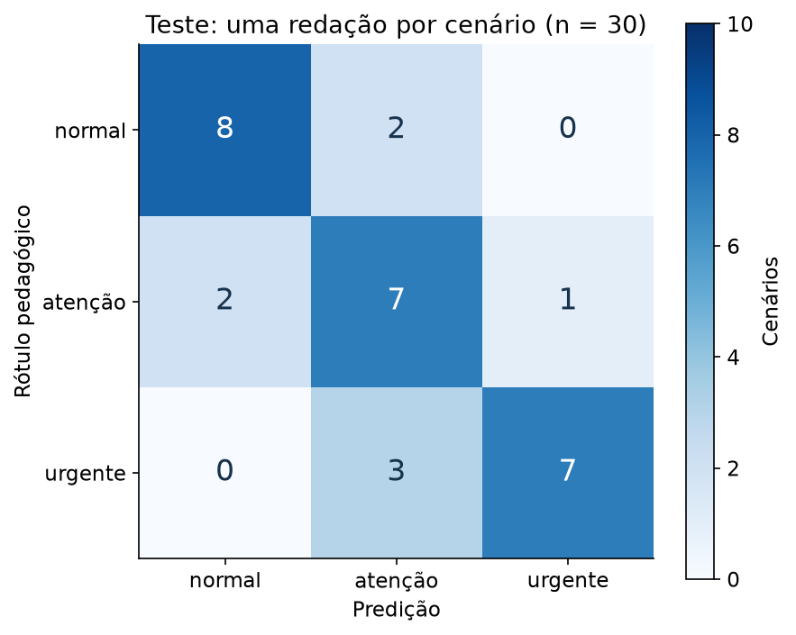

# Tech Challenge Fase 3 — urgência em laudos sintéticos

API de **demonstração acadêmica** que recebe um texto e classifica `normal`, `atenção` ou `urgente`, com TF-IDF + LogisticRegression, FastAPI, Docker, ONNX Runtime, Prometheus, Grafana, Airflow e GitHub Actions.

> Treinada exclusivamente com dados sintéticos. Não utilizar para triagem clínica, diagnóstico ou tratamento de pacientes. A confiança não é uma probabilidade de risco clínico. Não enviar dados de pacientes reais.

## Correção de escopo e adaptação do dataset

O [requisito](docs/requirements/MLET%20-%20Tech%20Challenge%20Fase%203.md) pede **urgência**. A implementação inicial classificava cinco categorias de doenças e **não atendia esse alvo**. Esta versão 0.2.0 corrige o modelo e o contrato; não é uma simples troca de nomes.

O [Medical Abstracts TC Corpus](https://github.com/sebischair/Medical-Abstracts-TC-Corpus), sugerido no enunciado e disponível em `data/raw`, contém abstracts com categorias de doenças, não rótulos de urgência. Seus CSVs originais permanecem intactos e fora do Git. Não é válido deduzir urgência apenas da doença.

**Adaptação autorizada pelo responsável:** criar uma base sintética separada para demonstrar o ciclo completo. Os cinco temas do corpus — neoplasias, sistema digestivo, sistema nervoso, cardiovascular e condições gerais — servem apenas de referência temática. Nenhum abstract original foi copiado para o treino ou recebeu um rótulo artificial de urgência.

A [receita auditável](src/techchallenge_fase3/synthetic_cases.py) contém 75 cenários e rótulos fictícios, criados com assistência de IA para esta demonstração, sem anotação clínica especializada. O [gerador](src/techchallenge_fase3/pipelines/generate.py) registra seed, hashes, origem e política no [manifesto](reports/data_generation.json).

| Partição | Cenários-base | Variações por cenário | Linhas |
|---|---:|---:|---:|
| Treino | 45 | 60 | 2.700 |
| Teste | 30 | 20 | 600 |

As classes são balanceadas por construção. Prefixos e sufixos neutros variam a redação, não o rótulo. Cada tema contém os três níveis. `scenario_id`, `source_theme` e `source_type` são metadados de auditoria; **somente `report_text` entra no modelo**.

**Limite essencial:** 3.300 linhas não são 3.300 casos clínicos independentes. O requisito menciona pelo menos 2.000 amostras; a expansão supera essa contagem de linhas, mas não comprova essa diversidade. A aceitação acadêmica da adaptação sintética deve ser confirmada pelo autor com a instituição. Não alegamos validação clínica nem cumprimento de um requisito de 2.000 casos reais.

## Executar do zero

Pré-requisitos: Python 3.11 ou 3.12, `uv` e Docker Desktop com Compose. Os comandos abaixo partem da raiz do repositório. Nenhuma instalação local de Airflow, Prometheus ou Grafana é necessária.

```powershell
git clone https://github.com/ygormartinelli/tech-challenge-fase-3.git
cd tech-challenge-fase-3
uv sync --frozen --all-groups
Copy-Item .env.example .env
uv run --frozen python -m techchallenge_fase3.pipelines.generate
uv run --frozen python -m techchallenge_fase3.pipelines.validate
uv run --frozen python -m techchallenge_fase3.pipelines.eda
```

Não sobrescreva um `.env` existente. Configure uma senha local para `GRAFANA_ADMIN_PASSWORD`. No Linux/macOS, use `cp .env.example .env`. CSVs e modelos não são commitados; os dados sintéticos podem ser reproduzidos sem baixar o corpus original.

Com `make` instalado:

```text
make pipeline
make notebook
make lint
make test
make compose
make smoke
```

Sem `make`, execute as etapas `validate`, `train`, `optimize`, `evaluate`, `benchmark` e `publish`, **nessa ordem**, usando `uv run --frozen python -m techchallenge_fase3.pipelines.<etapa>`. Pare se alguma falhar. Para o notebook: `uv run --frozen python scripts/build_notebook.py`.

```text
docker compose --env-file .env -f docker/docker-compose.yml up --build -d --wait
uv run --frozen python scripts/verify_stack.py
```

O primeiro build baixa as dependências; modelos não são incorporados à imagem. A API monta `models` somente para leitura. Sem uma release publicada e compatível, `/health` responde 503. Os arquivos `.env`, os dados e os modelos também ficam fora do contexto de build.

| Serviço | Endereço local | Acesso |
|---|---|---|
| API e exemplos interativos | http://localhost:8000/docs | Sem autenticação; somente localhost |
| Readiness | http://localhost:8000/health | Retorna tarefa, origem e variante |
| Métricas | http://localhost:8000/metrics | Prometheus |
| Prometheus | http://localhost:9090 | Target `api:8000` deve estar UP |
| Grafana | http://localhost:3000/d/medical-classifier | `admin` e senha do `.env` |
| Airflow, perfil opcional | http://localhost:8080 | Usuário `admin`; senha gerada pelo standalone |

Essas configurações são locais, sem TLS ou autenticação na API. Não exponha as portas à rede pública. Alterar a senha no `.env` não redefine uma senha já persistida pelo Grafana; use a administração do serviço nesse caso.

## Contrato da API

`POST /predict`, JSON com `report_text`, entre 10 e 20.000 caracteres após remover espaços externos. Campos extras, texto vazio e tipos incorretos retornam 422. Falhas de modelo retornam 503 genérico, sem expor caminhos ou o texto recebido.

Exemplo de **entrada fictícia**, que pode ser colado no Swagger:

```json
{"report_text": "Hemorragia ativa extensa após trauma com instabilidade circulatória."}
```

A resposta contém:

| Campo | Significado |
|---|---|
| `urgency_label` | 0, 1 ou 2 |
| `urgency` | `normal`, `atenção` ou `urgente`, respectivamente |
| `confidence` | Maior probabilidade do modelo; não calibrada |
| `model_variant` | `original` ou `optimized`, realmente utilizada |
| `data_origin` | Sempre `synthetic` |
| `requires_human_review` | Sempre `true`; não autoriza uso clínico |
| `disclaimer` | Advertência explícita de simulação acadêmica |

PowerShell:

```powershell
$payload = @{report_text = 'Hemorragia ativa extensa após trauma com instabilidade circulatória.'} | ConvertTo-Json
Invoke-RestMethod -Method Post -Uri http://localhost:8000/predict -ContentType 'application/json; charset=utf-8' -Body ([Text.Encoding]::UTF8.GetBytes($payload))
```

**Mudança incompatível:** `medical_abstract`, `condition_label` e `condition_name` pertencem à versão anterior. O carregador rejeita releases sem `task_id=synthetic_urgency_v1` e `data_origin=synthetic`, impedindo que o modelo de doenças seja servido como urgência.

## EDA e resultados de modelagem

Abra o [notebook executado](notebooks/01_eda_synthetic_triage.ipynb), com sete gráficos, cálculos reproduzíveis, análise de erros e conclusões. Há uma [síntese das decisões](docs/eda.md) e o [relatório agregado](reports/eda.json). `make notebook` também cria `reports/eda.html` localmente.

- Não foram observados nulos, conflitos de rótulo ou violações do limite textual na base gerada.
- Cenários separados antes da expansão; nenhum cenário ou texto normalizado compartilhado entre treino/teste. Holdout interno por cenário: 36 para treino e 9 para validação.
- O vocabulário é ajustado somente no treino. A EDA observou 14,81% de tokens do teste fora de seu vocabulário; não houve vetor de teste totalmente zerado. Esse diagnóstico usa o vetorizador exploratório, distinto do pipeline ONNX.
- Prefixos comuns e estilo autoral limitam a independência. O teste usa apenas as primeiras 20 combinações de estilo, explicando parte dos textos mais curtos. Não houve validação externa, temporal, demográfica ou por hospital.

| Avaliação | Acurácia | Macro-F1 |
|---|---:|---:|
| Majoritário na validação | 33,33% | 0,167 |
| Modelo na validação, 540 redações / 9 cenários | 63,89% | 0,615 |
| Teste, 600 redações / 30 cenários | 73,17% | 0,737 |
| Teste, primeira redação de cada um dos 30 cenários | 73,33% | 0,738 |

O teste por cenário teve **8 erros**, incluindo **3 urgentes classificados como atenção**. Recall de urgente: 70%, suporte de apenas 10 cenários urgentes. Os [erros e métricas por classe](reports/evaluation.json) permanecem visíveis. Não alteramos os rótulos ou o modelo em função dos erros do teste.



Esses resultados não estimam desempenho em pacientes reais. O modelo de unigramas pode falhar com negações, linguagem fora do domínio, abreviações ou contextos novos. A tokenização ASCII, compartilhada com ONNX, fragmenta palavras acentuadas. Não há detecção confiável de entrada fora de distribuição, calibração clínica ou protocolo de triagem validado.

## Otimização e latência

[Benchmark local de inferência](reports/latency_benchmark.json), CPU/Windows, 15/09/2026 (horário de Brasília): 20 aquecimentos, 200 textos em cada uma de três rodadas, ordem alternada. Mede rótulo **e** probabilidades, um texto por vez. Throughput abaixo é sequencial, não capacidade sob carga concorrente.

| Variante | Média (ms) | p50 (ms) | p95 (ms) | Predições/s |
|---|---:|---:|---:|---:|
| joblib / scikit-learn | 0,7632 | 0,7277 | 0,9845 | 1.310 |
| ONNX Runtime | 0,0375 | 0,0351 | 0,0471 | 26.690 |

O p50 ficou aproximadamente **20,7× menor** nesse ensaio. Paridade em 606 entradas (600 de teste + 6 bordas): zero divergências de classe; maior diferença absoluta de probabilidade 1,34×10⁻⁷, abaixo de 10⁻⁵. Isso comprova equivalência de implementação nesse conjunto, não correção clínica.

`optimized` só é aprovado quando há equivalência e p50 menor **em todas as três rodadas**. O relatório registra ambiente e hashes dos dados/modelos; falha no gate impede publicação. Não aplicamos quantização: o grafo exportado não possui os operadores elegíveis avaliados, e não foi demonstrado ganho adicional. ONNX float é a técnica de otimização entregue.

O [benchmark HTTP original](reports/http_original.json) e o [benchmark HTTP ONNX](reports/http_optimized.json) medem Docker + rede local + serialização, com 20 aquecimentos e 200 requisições. Não confunda seus tempos com inferência isolada.

| Variante HTTP | Média (ms) | p50 (ms) | p95 (ms) | Requisições/s sequenciais |
|---|---:|---:|---:|---:|
| Original | 9,887 | 7,515 | 27,654 | 101,1 |
| ONNX | 9,221 | 6,709 | 25,185 | 108,5 |

Esse ensaio HTTP tem uma rodada por variante; não é um teste de carga nem garante o mesmo ganho em outras máquinas. O gate usa as três rodadas de inferência isolada. Reprodução:

1. Defina `MODEL_VARIANT=original` no `.env` e recrie apenas a API.
2. Execute `make api-benchmark`.
3. Defina `MODEL_VARIANT=optimized`, recrie a API e repita.

```text
docker compose --env-file .env -f docker/docker-compose.yml up -d --force-recreate --wait api
```

Não rode builds, notebook ou retreino simultaneamente ao comparar latência. Resultados variam com a máquina. `make benchmark` repete a medição isolada e salva inclusive resultados rejeitados.

## Monitoramento

O [dashboard provisionado](docker/grafana/provisioning/dashboards/medical-classifier.json) tem quatro painéis: requisições, p50/p95 HTTP, falhas internas de inferência/s e proporção de respostas 4xx/5xx. `make smoke` gera sucessos e entradas inválidas durante várias coletas e consulta cada painel através do próprio Grafana; a [evidência](reports/stack_verification.json) registra respostas e target UP.

Métricas: `medical_classifier_requests_total`, `medical_classifier_request_duration_seconds` e `medical_classifier_prediction_errors_total`. Scrapes não contam como tráfego; rotas desconhecidas são agrupadas para limitar cardinalidade. Nenhum laudo é usado como label de métrica. Erros de classificação não são erros HTTP: **estes painéis medem saúde operacional, não segurança clínica**. Os quantis são estimativas dos buckets; sem tráfego recente podem ficar sem valores.

## Retreino no Airflow

```text
docker compose --env-file .env -f docker/docker-compose.yml --profile airflow up --build -d --wait
docker compose --env-file .env -f docker/docker-compose.yml exec airflow airflow dags trigger retrain_medical_classifier
```

Gere os CSVs antes de iniciar. O perfil opcional usa Airflow standalone em container e um ambiente separado para as dependências de ML. Para obter a senha gerada, consulte localmente `/opt/airflow/standalone_admin_password.txt` dentro do container; não a publique.

[DAG](dags/retrain_medical_classifier.py):

```text
validate → train → optimize → evaluate → benchmark → publish
```

Cada tarefa chama o módulo reutilizável correspondente. Valida três classes, origem e isolamento; treina candidato sem tocar no teste; exporta ONNX; avalia; mede equivalência/latência; publica. Não há geração de novos cenários durante o retreino: os mesmos dados versionados por hash são reusados. A execução é manual, sem agendamento e sem runs concorrentes da mesma DAG.

`models/releases` guarda releases imutáveis; `models/current.json` troca atomicamente. Uma falha preserva a publicação anterior. O candidato do Airflow e seus relatórios locais usam pastas próprias, separadas do treino CLI. Releases de joblib devem ser locais e confiáveis; não carregue arquivos enviados por terceiros.

A API mantém uma release por processo. Após retreino concluído, reinicie-a para adotar o novo ponteiro:

```text
docker compose --env-file .env -f docker/docker-compose.yml restart api
```

O [registro de aceitação do Airflow](reports/airflow_verification.json) identifica o run, estados das seis tarefas e benchmark no Linux do container. Uma importação da DAG não substitui essa execução real.

Run verificado: `acceptance-synthetic-urgency-20260916`, com seis sucessos pelo scheduler. Para registrar um run recém-concluído, antes de iniciar outro: `uv run --frozen python scripts/verify_airflow_run.py <run_id>`. A verificação confere o horário do benchmark e sua correspondência com a release publicada.

## CI e organização

[GitHub Actions](.github/workflows/ci.yml), em pushes e PRs:

- `quality`: instalação congelada, Ruff/formatação, pytest e compatibilidade de dependências.
- `docker-build`: build e smoke HTTP real em container, com fixture sintética; valida também Compose.
- `airflow-contract`: build da imagem e importação real da DAG, sem scheduler na CI.

Testes não precisam dos CSVs privados nem do Airflow instalado no host. O benchmark de produção é executado fora da CI compartilhada, onde ruído de CPU não deve alterar automaticamente uma decisão de publicação. A CI testa também a lógica do gate.

Validação local da revisão: 51 testes aprovados, Ruff e dependências compatíveis. Há um aviso de depreciação do cliente HTTP de testes, sem falha de compatibilidade; as versões atuais permanecem fixadas no lock.

Código coeso: Factory no carregamento de variantes e Strategy nos adaptadores scikit-learn/ONNX. Pipeline de treino centralizado; tarefas de orquestração não duplicam a lógica de ML. Configuração via `.env` e Pydantic Settings; dependências separadas e `uv.lock` commitado.

Rastreabilidade: [issues](https://github.com/ygormartinelli/tech-challenge-fase-3/issues), [Kanban](https://github.com/users/ygormartinelli/projects/1), milestone **Tech Challenge Fase 3**. A [issue #8](https://github.com/ygormartinelli/tech-challenge-fase-3/issues/8) registra a correção do alvo, autorização sintética e nova aceitação; as conclusões antigas de categorias não validam urgência.

## Decisão arquitetural de nuvem — proposta, não implantada

Para uma futura API validada, a escolha proposta é **inferência real-time em AWS ECS Fargate**, pois o fluxo descrito espera resposta a cada envio de laudo; batch fica restrito ao treino e às análises. A AWS documenta execução de containers sem gerenciar servidores e integração com balanceamento HTTP/HTTPS. [Documentação oficial](https://docs.aws.amazon.com/AmazonECS/latest/developerguide/AWS_Fargate.html).

Arquitetura proposta: cliente autenticado → balanceador HTTPS → serviço FastAPI no ECS/Fargate; imagem no ECR, artefatos versionados em S3 e retreino separado. Essa topologia é uma decisão de projeto, **não algo provisionado ou validado neste trabalho**. A passagem à produção exigiria autorização clínica, governança dos dados, controle de acesso, criptografia, observabilidade, revisão de segurança, teste de carga, política de atualização e custos. Não há benefício assistencial medido nem SLA comprovado.

## Rubrica e roteiro STAR

| Critério | Peso | Evidência / limite |
|---|---:|---|
| Modelagem e otimização | 20% | EDA, três urgências sintéticas, avaliação com erros, joblib/ONNX, benchmark com gate; sem validade clínica |
| CI/CD | 15% | Workflow lint → testes → builds/smokes; sem deploy de nuvem |
| Airflow | 15% | DAG com seis etapas e registro do scheduler |
| Monitoramento | 20% | Compose, dashboard JSON com quatro painéis e consultas verificadas |
| README | 15% | Execução, decisão arquitetural, contrato, adaptação e limitações |
| Vídeo STAR | 15% | Roteiro abaixo; gravação e link ainda dependem do autor |

Roteiro de **4min50s**, deixando 10 segundos de margem:

| Tempo | STAR | Fala e evidência a mostrar |
|---|---|---|
| 0:00–0:40 | Situation | “O enunciado propõe classificar urgência em laudos. O corpus sugerido tem doenças, não urgência. Adaptamos com dados sintéticos explicitamente identificados; não é triagem clínica.” Mostrar o aviso do README. |
| 0:40–1:15 | Task | “Entregar uma API com três níveis e comprovar CI/CD, retreino, monitoramento e ganho de latência.” Mostrar estrutura e issue #8. |
| 1:15–2:00 | Action | Explicar 75 cenários, 2.700/600 redações, separação por cenário e TF-IDF + regressão logística. Mostrar EDA e matriz de erros. |
| 2:00–2:40 | Action | Enviar texto fictício em `/docs`; mostrar urgência, variante e disclaimer. Apresentar brevemente Factory/Strategy e proteção contra releases antigas. |
| 2:40–3:30 | Action | Mostrar run Airflow com seis tarefas e checks do GitHub Actions; explicar publicação após o gate e restart da API. |
| 3:30–4:15 | Result | Mostrar Grafana com tráfego e relatório de latência. Explicar a diferença entre inferência isolada e HTTP, equivalência ONNX e ausência de quantização. |
| 4:15–4:50 | Result | “O ciclo técnico funciona. No teste sintético, 22/30 cenários corretos e três urgentes subestimados. Não há validade clínica; dados reais anotados e validação externa seriam necessários.” Encerrar com aprendizados e proposta AWS, não deploy. |

**Vídeo:** ainda não gravado. O PPT local anterior descreve cinco categorias e está desatualizado; não deve ser usado como evidência desta versão. O roteiro acima é o material atualizado para a gravação.

## Resolução de problemas e encerramento

- API 503: execute o pipeline completo e confira o manifesto da release; um modelo antigo de doenças é rejeitado por projeto.
- Falha de download no build: confira conectividade e repita; não ignore erro de instalação ou remova o lock.
- Airflow sem dados: execute `make generate` e confira o volume de `data/synthetic_triage`.
- Grafana sem curva: execute `make smoke` e espere coletas com tráfego; janela padrão de 15 minutos.
- Benchmark rejeitado: examine o relatório; não force `optimized_approved`. A API anterior continua disponível até uma publicação válida.
- Sem `make`: use os comandos Python equivalentes descritos acima.

```text
docker compose --env-file .env -f docker/docker-compose.yml --profile airflow down
```

O comando preserva os volumes. Não use `down -v` se quiser manter o histórico local. O [notebook original de categorias](notebooks/01_eda_medical_abstracts.ipynb) e os relatórios antigos de diagnóstico são históricos do corpus sugerido, não resultados da versão de urgência.
